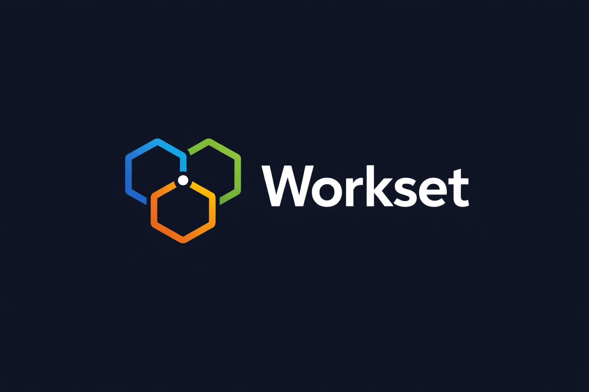

# Workset

[](https://github.com/strantalis/workset/actions/workflows/test.yml)
[](https://github.com/strantalis/workset/actions/workflows/lint.yml)
[](https://github.com/strantalis/workset/actions/workflows/release.yml)
[](https://github.com/strantalis/workset/actions/workflows/docs.yml)

<p align="center">
  
</p>

Workset is a Go CLI for managing **multi-repo threads** with **linked Git worktrees** by default. It captures intent ("these repos move together") and keeps multi-repo work safe, explicit, and predictable. It also includes a Wails desktop app in `wails-ui/workset`.

## Why Workset

Every dev has that one side project that started as "I'll just write a quick script" and somehow ended up with a build pipeline. This is mine.

The problem was simple: I work across multiple repos and kept losing track of which branches went together. The reasonable fix was a shell alias. What I built instead has a CLI, a desktop app with embedded terminals, AI-generated pull requests, a daemon that manages PTY sessions, and a skill marketplace. At no point did anyone ask for this.

If you're here, you either have the same multi-repo problem or you're morbidly curious about what happens when scope creep goes unsupervised. Either way, welcome.

- **Threads first**: treat related repos as a single unit of work.
- **Linked worktrees by default**: branch work happens in isolated directories without duplicating repos.
- **Worksets**: reusable repo bundles — spin up new threads from the same set with one command.
- **Safe defaults**: no destructive actions without explicit flags.
- **Desktop app**: GUI for thread management, terminals, and GitHub workflows.
- **AI-powered**: generate PR text and commit messages with pluggable agents (Codex, Claude).

> [!NOTE]
> Workset is under active development; interfaces and behavior may change without notice.

## Quickstart

Install (recommended):

```bash
brew tap strantalis/homebrew-tap
brew install workset
```

Upgrade (Homebrew):

```bash
brew update
brew upgrade --cask workset
```

Install (npm):

```bash
npm install -g @strantalis/workset@latest
```

Alternative (Go install):

```bash
go install github.com/strantalis/workset/cmd/workset@latest
```

Create a thread and add repos:

```bash
workset new demo
workset repo add git@github.com:your/org-repo.git -t demo
workset status -t demo
```

Worksets (reusable repo bundles):

```bash
workset repo registry add platform git@github.com:org/platform.git
workset repo registry add api git@github.com:org/api.git
workset new auth-spike --workset platform-core --repo platform --repo api
```

## Docs

Docs are built with **MkDocs + Material**. The site config is `mkdocs.yml`, markdown content lives in `docs/`, and the published site is [workset.dev](https://workset.dev).

Local dev (requires `uv`):

```bash
make docs-serve
```

