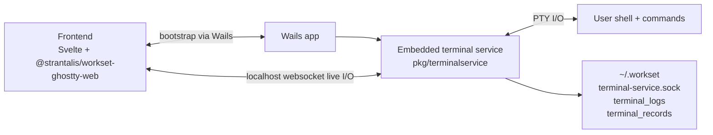
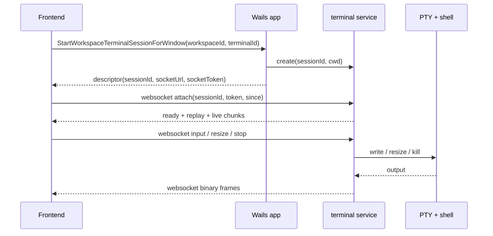

# Terminal Architecture

This document describes the current Workset desktop terminal stack.

> Historical note: older revisions of this stack used a separate `workset-sessiond` sidecar. Workset now embeds that runtime in-process as the desktop terminal service. References to `pkg/terminalservice` below describe the implementation package, not a shipped daemon.

## Components

- **Frontend (Svelte + `@strantalis/workset-ghostty-web`)** renders terminal state and emits user input plus protocol responses.
- **Wails app (Go)** hosts the embedded terminal service and owns bootstrap plus app integration.
- **Embedded terminal service (`pkg/terminalservice`)** owns PTYs, replay buffers, and the live websocket stream.
- **Shell process** runs inside the PTY.
- **Local state** in `~/.workset` for the terminal service socket, transcripts, and records.

## Source of truth

The PTY stream is the source of truth.

- `pkg/terminalservice` owns PTY creation, replay buffers, and live stream fanout.
- The Wails app does not keep an independent ownership or lease map.
- The frontend renders terminal bytes via the published `@strantalis/workset-ghostty-web` package and sends input over the live websocket.

## Session lifecycle

1. The frontend asks Wails for a terminal bootstrap descriptor via `StartWorkspaceTerminalSessionForWindow`.
2. The Wails app ensures the embedded terminal service is running and calls `create(sessionId, cwd)` over the local control plane.
3. The terminal service starts the user shell inside a PTY and keeps transcript / replay state.
4. The Wails app returns a descriptor containing:
   - `sessionId`
   - `socketUrl`
   - `socketToken`
5. The frontend opens the websocket, sends `attach`, receives `ready`, replays backlog if needed, then becomes live.
6. Live `input`, `resize`, and `stop` traffic stays on the websocket path.

## Runtime model

- Terminals are writable once attached.
- Popouts and workspace views do not perform backend ownership handoff.
- Restart restore is visual only: Workset restores flat tab and split layout plus a lightweight snapshot, then starts fresh shell processes.

## Data flow

## Environment contract

Workset currently runs shells with the inherited host environment plus Workset context vars:

- `WORKSET_WORKSPACE`
- `WORKSET_ROOT`
- `SHELL`

Workset preserves existing terminal hints such as `TERM`, `COLORTERM`, `TERM_PROGRAM`, and `KITTY_*` when the host provides them. If `TERM` is missing, the terminal service defaults it to `xterm-256color` before launching the shell so prompt and tooling startup can rely on a valid terminal type.

## Persistence and replay

- Session IDs are `workspaceId::terminalId`.
- Reusing a session ID reattaches to the same PTY while the app keeps it alive.
- `pkg/terminalservice` maintains a replay buffer and transcript files so same-runtime attaches can resume without restarting the shell.
- Full app restart does not preserve processes. Workset restores layout and a cosmetic snapshot, then launches fresh terminals.

## Config knobs

- `defaults.terminal_idle_timeout` controls idle shutdown.
- `defaults.terminal_protocol_log` enables protocol logging in the terminal service on the next app launch.
- `defaults.terminal_debug_overlay` controls the frontend terminal debug strip.
- `defaults.agent` controls the default coding agent for terminal launchers and PR generation.
- `WORKSET_TERMINAL_SERVICE_SOCKET` overrides the Unix socket path. Wails dev builds may use a dev socket to avoid contention with production.
- `WORKSET_TERMINAL_DEBUG_LOG=1` enables opt-in terminal lifecycle debug logging to `~/.workset/terminal_debug.log` (or `WORKSET_TERMINAL_DEBUG_LOG_PATH`).

Protocol logs are written to `~/.workset/terminal_logs/unified_terminal-service.log` when enabled.
Terminal service stdout and stderr are reserved for warnings and failures; attach, resize, and subscriber chatter is kept in the opt-in debug log.
