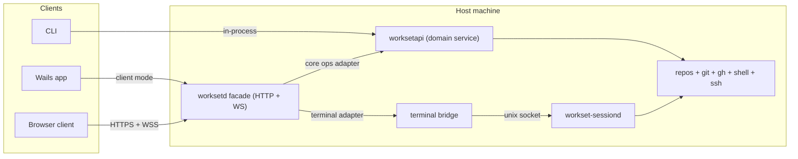
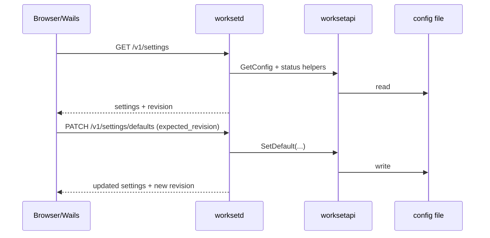
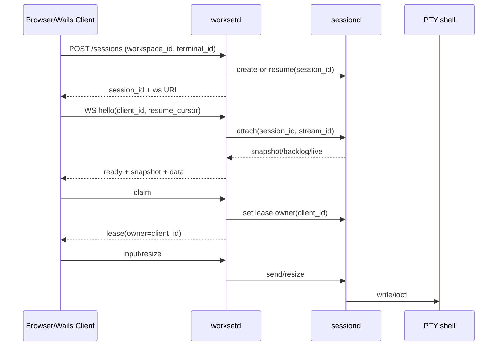
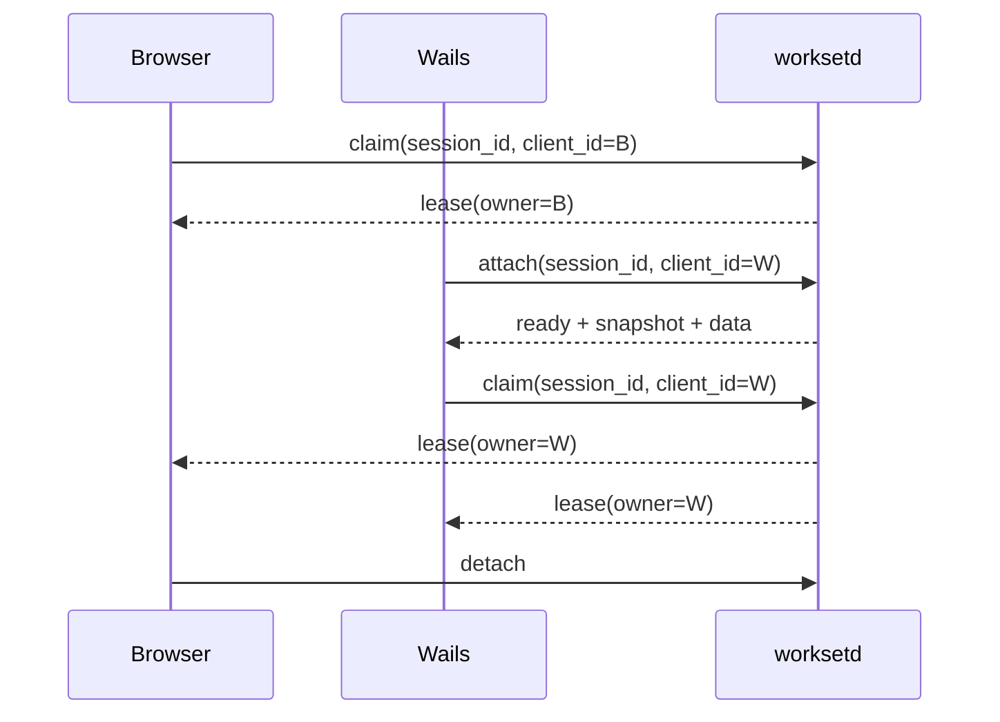
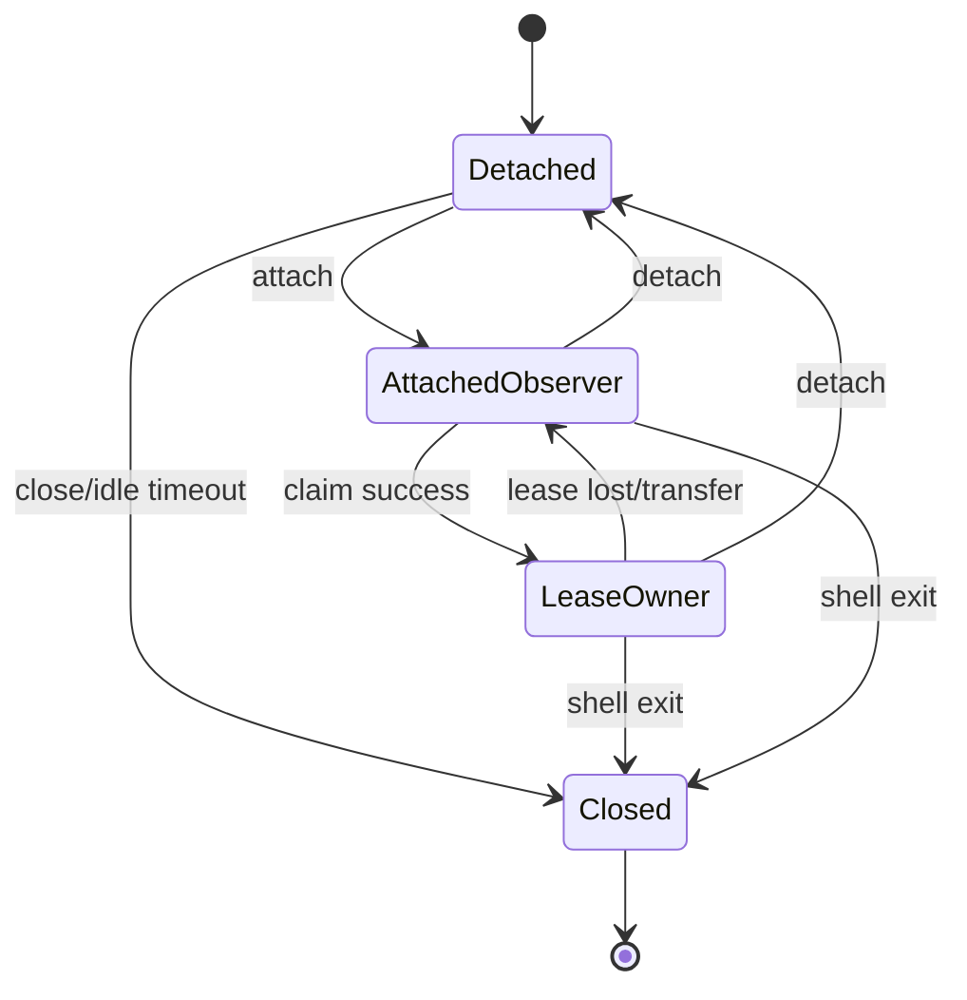
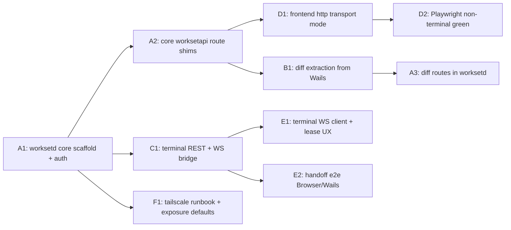

# Browser + Wails Terminal Handoff Plan

## Objective

Enable one live terminal session to move between:

- browser client (Playwright-targetable HTTP app)
- Wails desktop app

without restarting the shell process or losing output continuity, while reusing the existing shared service layer.

## Current reality

- `pkg/worksetapi` is already the shared domain service used by CLI and Wails for workspace/repo/GitHub/config flows.
- Wails methods in `wails-ui/workset/app_manage.go` and `wails-ui/workset/app_github.go` are largely adapters over `worksetapi`.
- Wails settings methods in `wails-ui/workset/app_settings.go` are adapters over `worksetapi` (`GetConfig`, `SetDefault`, agent/env helpers).
- Terminal flows are currently Wails-specific and routed through app/sessiond orchestration code.
- Some Git/diff flows still live directly in Wails app code (`wails-ui/workset/app_diffs.go`) and are not yet in `worksetapi`.

This means the migration is mostly adapter work for non-terminal features, plus a focused terminal bridge project.

## Non-goals (initial rollout)

- Rewriting `sessiond` internals.
- Exposing `sessiond.sock` directly over the network.
- Requiring Linux containers to mirror macOS host paths/tooling.
- Replacing CLI flows; CLI continues using `worksetapi` directly.

## Design principles

1. `worksetapi` remains the business-logic authority for core operations.
2. `sessiond` remains the PTY authority for terminal operations.
3. `worksetd` is an API facade/adapter layer, not a second domain layer.
4. Browser and Wails both act as clients of shared contracts.
5. Terminal input ownership is lease-based and explicit.
6. Read-only terminal attach is always allowed.

## Target architecture

## API layering model

### Layer 1: Domain (`worksetapi`)

- Workspace and repo management.
- GitHub and Git-oriented workflows already implemented in service methods.
- Configuration, groups, aliases, hooks, skills, snapshots.
- Settings persistence and operational setting helpers (defaults, agent CLI path, env reload, GitHub CLI path/auth metadata).

### Layer 2: API facade (`worksetd`)

- HTTP/WS transport.
- Auth/session handling.
- Request validation and route mapping.
- Job/event streaming for long-running operations.

### Layer 3: Terminal bridge

- Bridges WS clients to `sessiond`.
- Maintains client/session/lease registry.
- Emits terminal stream events and ownership changes.

## Shim vs extraction plan

| Area | Current state | Implementation strategy |
| --- | --- | --- |
| Settings and defaults | Already in `worksetapi` + Wails adapters | Add HTTP shim routes + conflict-safe update semantics |
| Workspace/config/registry/groups/hooks | Already in `worksetapi` | Add HTTP shim routes over existing methods |
| GitHub and PR flows | Mostly in `worksetapi` | Add HTTP shim + async job facade |
| Repo diff/read APIs | In Wails app (`app_diffs.go`) | Extract to reusable service package, then expose via `worksetd` |
| Terminal lifecycle/streaming | Wails + `sessiond` specific | Build dedicated terminal WS bridge; do not force into `worksetapi` |

## Settings management model

Settings are split into three classes with different ownership:

1. Persistent global defaults (authoritative in config file).
2. Operational environment/tooling settings (resolved on host at runtime).
3. UI-local presentation settings (pure frontend state, not server-owned).

### 1) Persistent global defaults

- Source of truth: `worksetapi` config load/save flow.
- Includes values such as:
  - `defaults.remote`
  - `defaults.base_branch`
  - `defaults.workspace_root`
  - `defaults.repo_store_root`
  - `defaults.agent`
  - `defaults.agent_model`
  - `defaults.terminal_idle_timeout`
  - `defaults.terminal_protocol_log`
  - `defaults.terminal_debug_overlay`
- Browser, Wails, and CLI all mutate these through the same backend contract.

### 2) Operational settings/status

- Host-derived and environment-sensitive, exposed via APIs:
  - agent CLI status/path
  - GitHub auth mode/status/CLI path
  - login environment reload snapshot
  - sessiond status/restart
- Not all operational fields are persisted in config; some are diagnostics/actions.

### 3) UI-local settings

- Kept in frontend local state/local storage.
- Not shared across clients unless explicitly promoted to server-owned settings.

### Consistency and conflict policy

- `worksetd` should expose a config revision token (or last-updated timestamp) with settings reads.
- Mutating settings endpoints should support optimistic concurrency:
  - request includes expected revision
  - mismatch returns conflict so client can refresh and retry
- This prevents browser and Wails from silently clobbering each other.

### Settings data flow

## Core API contract (non-terminal)

These routes are primarily adapters over existing `worksetapi` methods.

### Core REST

- `GET /v1/workspaces`
- `POST /v1/workspaces`
- `GET /v1/workspaces/{workspace_id}/status`
- `GET /v1/workspaces/{workspace_id}/repos`
- `POST /v1/workspaces/{workspace_id}/repos`
- `DELETE /v1/workspaces/{workspace_id}/repos/{repo_id}`
- `GET /v1/repos/{repo_id}/local-status`
- `GET /v1/repos/{repo_id}/diff`
- `GET /v1/repos/{repo_id}/file-diff`
- `GET /v1/settings`
- `PATCH /v1/settings/defaults`
- `POST /v1/settings/env/reload`
- `GET /v1/settings/agents/{agent}/status`
- `PATCH /v1/settings/agents/{agent}/cli-path`
- `GET /v1/settings/github/auth`
- `PATCH /v1/settings/github/cli-path`
- `GET /v1/settings/sessiond/status`
- `POST /v1/settings/sessiond/restart`
- `POST /v1/github/pull-requests`
- `POST /v1/github/commit-and-push`

### Async jobs for mutating operations

- `POST /v1/jobs/git/commit-and-push`
- `POST /v1/jobs/git/create-pr`
- `GET /v1/jobs/{job_id}`
- `GET /v1/jobs/{job_id}/events` (SSE or WS stream)

Job event types:

- `job.started`
- `job.progress`
- `job.completed`
- `job.failed`

## Terminal contract (separate from core `worksetapi`)

### Concepts

- `session_id`: stable identity for one PTY-backed shell session.
- `client_id`: stable identity for one frontend instance/window.
- `lease_owner`: client allowed to send `input` and `resize`.
- `observer`: attached client that can read output but not mutate.
- `lease_ttl`: short renewable interval (for crash recovery).

### Handoff rules

1. Multiple clients may attach as observers.
2. Exactly one client holds write lease at a time.
3. Lease transfer is explicit (`claim` / `transfer`) and emits events.
4. Detach does not kill the session by default.
5. Session survives client restarts until idle timeout / explicit close.

### Terminal REST

- `POST /v1/terminal/sessions`
  - creates or resumes terminal session
  - input `{ workspace_id, terminal_id, cwd }`
  - returns `{ session_id, stream_url, replay_cursor }`
- `POST /v1/terminal/sessions/{session_id}/claim`
  - body `{ client_id, force?: boolean }`
  - returns `{ lease_owner, lease_expires_at }`
- `POST /v1/terminal/sessions/{session_id}/detach`
  - body `{ client_id }`
- `POST /v1/terminal/sessions/{session_id}/close`
  - body `{ reason }`
- `GET /v1/terminal/sessions/{session_id}`
  - returns session status, owner, and connected clients

### Terminal WebSocket

- `GET /v1/terminal/streams/{session_id}?client_id=...&cursor=...`

Client -> server frames:

- `{"type":"hello","client_id":"...","resume_cursor":"..."}`
- `{"type":"input","data_b64":"..."}`
- `{"type":"resize","cols":120,"rows":40}`
- `{"type":"claim","force":false}`
- `{"type":"heartbeat"}`
- `{"type":"detach"}`

Server -> client frames:

- `{"type":"ready","session_id":"...","lease_owner":"...","cursor":"..."}`
- `{"type":"data","data_b64":"...","cursor":"..."}`
- `{"type":"snapshot","data_b64":"...","cursor":"..."}`
- `{"type":"lease","owner":"...","expires_at":"..."}`
- `{"type":"mode","alt_screen":false,"mouse_mode":false}`
- `{"type":"exit","code":0,"reason":"..."}`
- `{"type":"error","code":"...","message":"..."}`

## Critical flows

### Attach + claim + stream

### Browser -> Wails transfer

### State machine

## Parallel workstreams

### Track A: Core facade over `worksetapi`

- Implement authenticated HTTP routes mapped to existing `worksetapi` service calls.
- Add request/response DTO mapping and error normalization.
- Add async job framework for long-running mutations.
- Include full settings surface parity (defaults + agent/github/env/sessiond settings APIs).

Deliverables:

- Core API endpoints with minimal behavioral change.
- contract tests against existing service semantics.

### Track B: Diff extraction and Git read parity

- Move Wails-only diff/read logic from `wails-ui/workset/app_diffs.go` into reusable service package.
- Keep method signatures stable for Wails during extraction.
- Expose extracted operations through `worksetd` routes.

Deliverables:

- Shared diff service + tests.
- browser parity for diff/read screens.

### Track C: Terminal bridge (`worksetd` <-> `sessiond`)

- Implement session registry, client registry, and lease manager.
- Bridge terminal control and streaming to existing `sessiond` client/protocol.
- Emit deterministic stream cursors and lease events.

Deliverables:

- Terminal REST + WS endpoints.
- contract tests for frame ordering, replay, and lease transitions.

### Track D: Frontend transport split

- Add `WorksetClient` interface with `wails` and `http` implementations.
- Keep existing Wails mode untouched as fallback.
- Gate existing Wails-binding assumption behind transport mode in e2e harness.
- Keep view models and screens transport-agnostic.
- Route settings screens through the same transport abstraction (no direct Wails binding usage in components).

Deliverables:

- transport adapters + shared DTOs.
- non-terminal Playwright specs passing in `http` mode.

### Track E: Terminal handoff UX

- Add WS terminal transport in frontend.
- Add claim/release affordances and conflict UI.
- Add handoff actions: `Open in Browser`, `Open in Desktop`, `Take Control`.

Deliverables:

- terminal attach/claim/release flow in browser and Wails.
- transfer e2e coverage.

### Track F: Ops + security + tailscale

- Bind `worksetd` to loopback by default.
- Add auth token/session cookie for API and WS.
- Provide `tailscale serve` recipe and hardened defaults.

Deliverables:

- deployment/runbook docs.
- auth and exposure guardrails.

## Dependency graph for parallelization

## Phase plan (Playwright-first)

### Phase 0: Contract + scaffolding

- Freeze core + terminal schemas.
- Add `worksetd` health endpoint, auth stub, and process wiring.
- Add frontend transport interface and mode selection.

Exit:

- app builds in both transport modes.

### Phase 1: Browser e2e baseline (no terminal handoff yet)

- Implement core HTTP endpoints as `worksetapi` shims for current non-terminal screens.
- Remove hard dependency on injected Wails bindings in e2e harness.
- Move settings UI calls onto transport abstraction and verify parity for settings flows.
- Keep terminal specs skipped in `http` mode.

Exit:

- Playwright green for non-terminal suites against `worksetd`.

### Phase 2: Diff extraction + terminal bridge foundation

- Extract Wails-only diff/read logic into shared service package.
- Implement terminal stream bridge and lease manager in backend.
- Validate `session_id` continuity across reconnect.

Exit:

- Diff/read parity for browser and Wails.
- Terminal contract stable in backend.

### Phase 3: Terminal clients + session handoff

- Implement browser terminal WS attach/input/resize.
- Implement Wails terminal client mode against `worksetd` terminal APIs.
- Implement claim/transfer UX.
- Add reconnect + replay cursor behavior with cursor correctness checks.
- Add e2e handoff scenarios (Browser->Wails->Browser).

Exit:

- No shell restart across transfers; output continuity preserved.

### Phase 4: Hardening

- Add auth hardening, rate limits, idle cleanup, and audit metadata.
- Stress tests for double attach, lease contention, and reconnect races.
- Add failure-injection tests for daemon restarts and dropped WS links.

Exit:

- Stable under churn; safe for Tailscale remote access.

## Acceptance criteria

- Core browser workflows run through `worksetapi`-backed HTTP APIs with no Wails runtime dependency.
- Settings changes made in browser are visible in Wails and CLI without divergence.
- Settings conflict behavior is deterministic (no silent last-writer wins without revision check).
- A terminal session created in one client can be claimed by another without process restart.
- Lease ownership changes are explicit and observable in both clients.
- Browser e2e no longer depends on Wails runtime injection.
- Remote access via Tailscale works with host-native tooling/path behavior.

## Open decisions

- Auth model for local + tailscale (token vs OAuth/device identity).
- Single-writer strictness (hard reject) vs queued takeover policy.
- Session retention defaults for detached sessions.
- Whether Wails should eventually always use HTTP transport for full parity.
