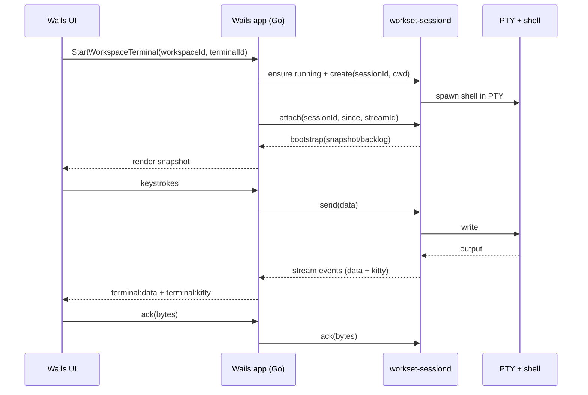

# Terminal Architecture

This document describes how the Workset desktop app runs terminals and streams output to the UI.

## Components

- **Wails UI (Svelte + xterm.js)** renders terminal output and captures input.
- **Wails backend (Go app)** brokers terminal lifecycle and configuration.
- **`workset-sessiond` daemon** owns PTYs, buffers output, and generates snapshots.
- **Shell process** runs inside the PTY.
- **Local state** in `~/.workset` for sockets, logs, and snapshots.

```mermaid
flowchart LR
  UI[Wails UI<br/>Svelte + xterm.js] <-- events + input --> App[Wails app (Go)]
  App <-- JSON control + stream --> D[workset-sessiond]
  D <-- PTY I/O --> Shell[User shell + commands]
  D --> State[~/.workset<br/>sessiond.sock<br/>terminal_state<br/>terminal_logs<br/>terminal_records]
```

## Session lifecycle

1. The UI asks the Go app to start a terminal (`StartWorkspaceTerminal`).
2. The Go app ensures `workset-sessiond` is running and sends a `create` request.
3. `workset-sessiond` spawns the user's shell in a PTY, sets `TERM=xterm-256color`, and injects `WORKSET_WORKSPACE` / `WORKSET_ROOT`.
4. The Go app attaches a stream (`attach`) and receives an initial bootstrap payload (snapshot + backlog).
5. The UI renders the snapshot, then applies streamed updates.

## Data flow and backpressure



`workset-sessiond` uses a credit-based stream so the UI can acknowledge bytes and prevent unbounded buffering.

## Persistence and resume

- Session IDs are `workspaceId::terminalId`. Re-using an ID resumes the same terminal stream.
- `workset-sessiond` maintains a terminal buffer plus periodic snapshots.
- The app stores terminal mode state under `~/.workset/terminal_state` so it can restore UI state after restart.

## Config knobs

- `defaults.terminal_idle_timeout` controls idle shutdown (used by both the daemon and the app).
- `defaults.terminal_renderer` selects `auto`, `webgl`, or `canvas` for xterm.js rendering.
- `defaults.terminal_protocol_log` enables OSC/CSI/DSR protocol logging (restart daemon to apply).
- `defaults.agent` controls the default coding agent for terminal launchers and PR generation.
- `WORKSET_SESSIOND_SOCKET` overrides the session daemon socket path (default `~/.workset/sessiond.sock`).
  Wails dev builds use `~/.workset/sessiond-dev.sock` to avoid contention with production.

Protocol logs are written to `~/.workset/terminal_logs/unified_sessiond.log` and
`~/.workset/terminal_logs/unified_termemu.log` when enabled.
