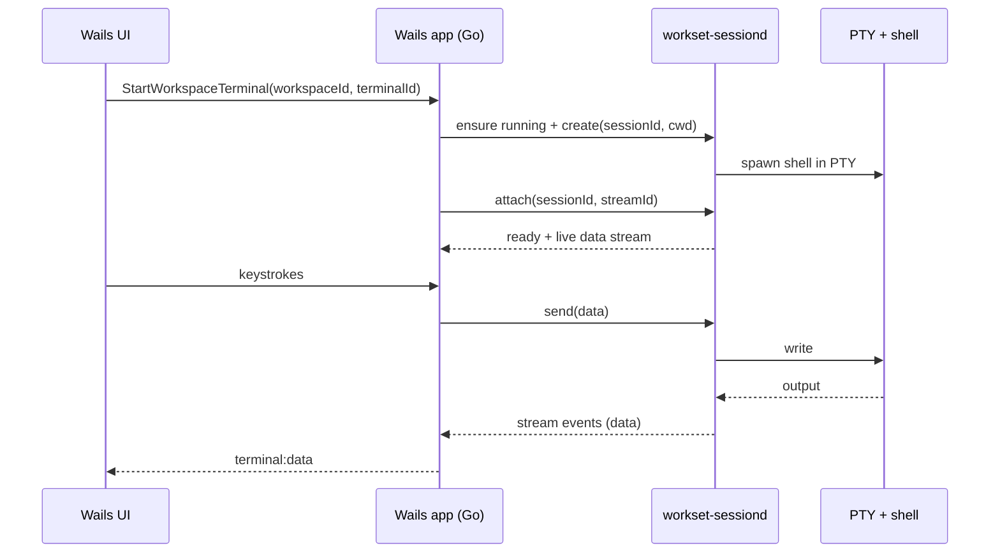

# Terminal Architecture

This document describes how the Workset desktop app runs terminals and streams output to the UI.

## Components

- **Wails UI (Svelte + xterm.js)** renders terminal output and captures input.
- **Wails backend (Go app)** brokers terminal lifecycle and configuration.
- **`workset-sessiond` daemon** owns PTYs and streams raw bytes.
- **Shell process** runs inside the PTY.
- **Local state** in `~/.workset` for sockets, transcripts, and records.

```mermaid
flowchart LR
  UI[Wails UI<br/>Svelte + xterm.js] <-- events + input --> App[Wails app (Go)]
  App <-- JSON control + stream --> D[workset-sessiond]
  D <-- PTY I/O --> Shell[User shell + commands]
  D --> State[~/.workset<br/>sessiond.sock<br/>terminal_state<br/>terminal_logs<br/>terminal_records]
```

## Terminal 101 (glossary)

- **PTY (pseudo-terminal)**: OS-level device pair that makes a process (the shell) think it is talking to a terminal.
- **Terminal emulator**: Interprets escape sequences (ANSI, CSI, OSC) and maintains screen state. In Workset, this is xterm.js in the UI.
- **Renderer**: Draws terminal output. In Workset, that is xterm.js.
- **Alt screen**: A separate screen buffer used by full-screen apps (vim, less). It is not safe to replay as normal output.

## Source of truth

The shell process and PTY stream are the source of truth.

- `workset-sessiond` forwards PTY output bytes and enforces input ownership.
- The Wails backend forwards events and does not interpret terminal bytes.
- The UI renders bytes via xterm.js and captures keyboard input.

## Session lifecycle

1. The UI asks the Go app to start a terminal (`StartWorkspaceTerminal`).
2. The Go app ensures `workset-sessiond` is running and sends a `create` request.
3. `workset-sessiond` spawns the user's shell in a PTY, sets `TERM=xterm-256color` + `COLORTERM=truecolor`, and injects `WORKSET_WORKSPACE` / `WORKSET_ROOT`.
4. The Go app attaches a stream (`attach`) and receives a `ready` event followed by live output.
5. The UI renders streamed output directly in xterm.js.

## Data flow and backpressure



## Persistence and resume

- Session IDs are `workspaceId::terminalId`. Re-using an ID reattaches to the same live PTY while the daemon keeps it running.
- The app stores terminal mode state under `~/.workset/terminal_state` so it can restore UI state after restart.

## Config knobs

- `defaults.terminal_idle_timeout` controls idle shutdown (used by both the daemon and the app).
- `defaults.terminal_protocol_log` enables OSC/CSI/DSR protocol logging (restart daemon to apply).
- `defaults.terminal_debug_overlay` shows the terminal debug overlay (bytes in/out, backlog, timestamps).
- `defaults.agent` controls the default coding agent for terminal launchers and PR generation (supported: `codex`, `claude`).
- `WORKSET_SESSIOND_SOCKET` overrides the session daemon socket path (default `~/.workset/sessiond.sock`).
  Wails dev builds use `~/.workset/sessiond-dev.sock` to avoid contention with production.

Protocol logs are written to `~/.workset/terminal_logs/unified_sessiond.log` when enabled.
