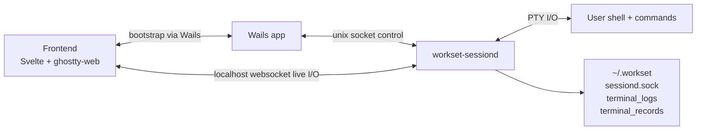
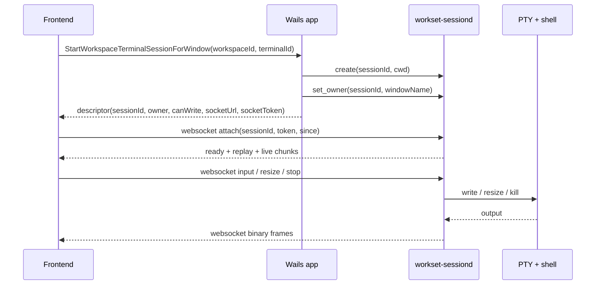

# Terminal Architecture

This document describes the current Workset desktop terminal stack.

## Components

- **Frontend (Svelte + `ghostty-web`)** renders terminal state and emits user input plus protocol responses.
- **Wails app (Go)** is a thin desktop broker for bootstrap, window identity, and app integration.
- **`workset-sessiond` daemon** owns PTYs, terminal leases, replay buffers, and the live websocket stream.
- **Shell process** runs inside the PTY.
- **Local state** in `~/.workset` for the daemon socket, transcripts, and records.

```mermaid
flowchart LR
  UI[Frontend<br/>Svelte + ghostty-web] <-- bootstrap via Wails --> App[Wails app]
  App <-- unix socket control --> D[workset-sessiond]
  UI <-- localhost websocket live I/O --> D
  D <-- PTY I/O --> Shell[User shell + commands]
  D --> State[~/.workset<br/>sessiond.sock<br/>terminal_logs<br/>terminal_records]
```

## Source of truth

The PTY stream is the source of truth, and `workset-sessiond` is the source of truth for terminal leases.

- `sessiond` owns PTY creation, replay buffers, terminal ownership, and live stream fanout.
- The Wails app does not keep an independent owner map.
- The frontend renders terminal bytes via `ghostty-web` and sends input over the live websocket.

## Session lifecycle

1. The frontend asks Wails for a terminal bootstrap descriptor via `StartWorkspaceTerminalSessionForWindow`.
2. The Wails app ensures `sessiond` is running and calls `create(sessionId, cwd)` over the Unix socket control plane.
3. `sessiond` starts the user shell inside a PTY and keeps transcript / replay state.
4. The Wails app sets the daemon lease owner for the workspace window and returns a descriptor containing:
   - `sessionId`
   - `owner`
   - `canWrite`
   - `currentOffset`
   - `socketUrl`
   - `socketToken`
5. The frontend opens the websocket, sends `attach`, receives `ready`, replays backlog if needed, then becomes live.
6. Live `input`, `resize`, `set_owner`, and `stop` traffic stays on the websocket path.

## Ownership model

- Ownership is enforced in `sessiond`, not in the app or frontend.
- `send`, `resize`, and `stop` require the active lease owner when a session is leased.
- `set_owner` transfers the lease explicitly.
- Viewer attaches are allowed, but only the owner gets `canWrite=true`.

## Data flow

```mermaid
sequenceDiagram
  participant UI as Frontend
  participant App as Wails app
  participant D as workset-sessiond
  participant PTY as PTY + shell

  UI->>App: StartWorkspaceTerminalSessionForWindow(workspaceId, terminalId)
  App->>D: create(sessionId, cwd)
  App->>D: set_owner(sessionId, windowName)
  App-->>UI: descriptor(sessionId, owner, canWrite, socketUrl, socketToken)

  UI->>D: websocket attach(sessionId, token, since)
  D-->>UI: ready + replay + live chunks

  UI->>D: websocket input / resize / stop
  D->>PTY: write / resize / kill
  PTY-->>D: output
  D-->>UI: websocket binary frames
```

## Environment contract

Workset currently runs shells with the inherited host environment plus Workset context vars:

- `WORKSET_WORKSPACE`
- `WORKSET_ROOT`
- `SHELL`

Workset does **not** currently rewrite `TERM`, `COLORTERM`, `TERM_PROGRAM`, `KITTY_*`, or OSC payloads as part of normal terminal startup.

## Persistence and replay

- Session IDs are `workspaceId::terminalId`.
- Reusing a session ID reattaches to the same daemon-owned PTY while the daemon keeps it alive.
- `sessiond` maintains a replay buffer and transcript files so reconnects can resume from an offset instead of restarting the shell.

## Config knobs

- `defaults.terminal_idle_timeout` controls idle shutdown.
- `defaults.terminal_protocol_log` enables protocol logging in `sessiond` after daemon restart.
- `defaults.terminal_debug_overlay` controls the frontend terminal debug strip.
- `defaults.agent` controls the default coding agent for terminal launchers and PR generation.
- `WORKSET_SESSIOND_SOCKET` overrides the Unix socket path. Wails dev builds may use a dev socket to avoid contention with production.

Protocol logs are written to `~/.workset/terminal_logs/unified_sessiond.log` when enabled.
